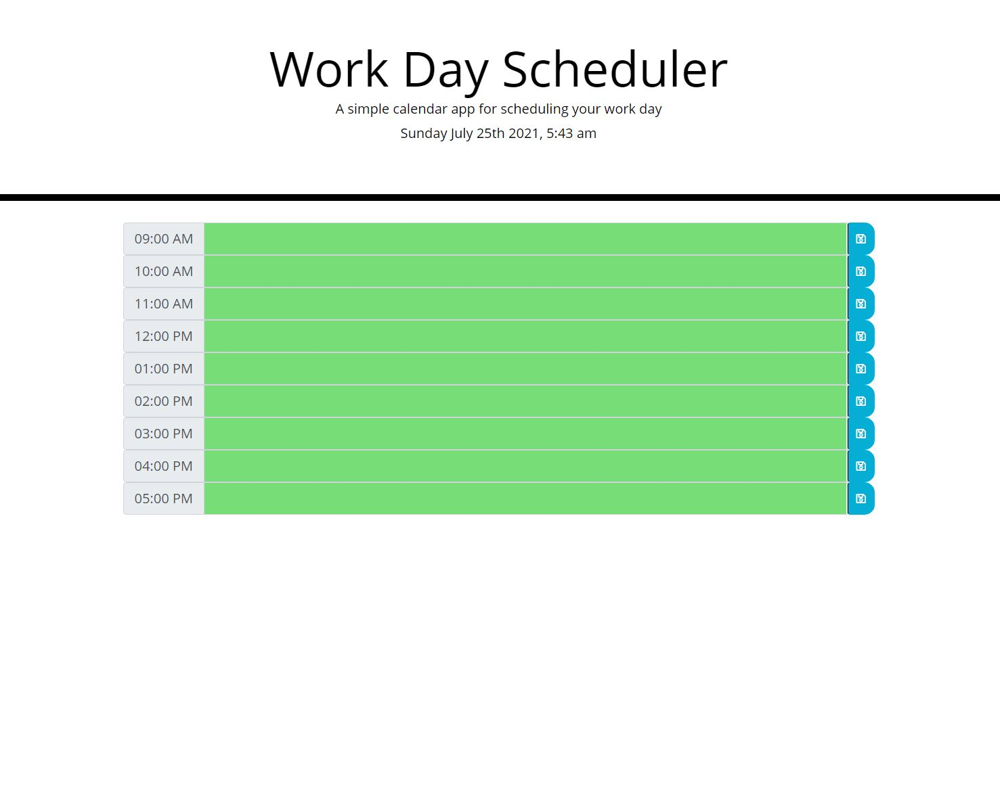
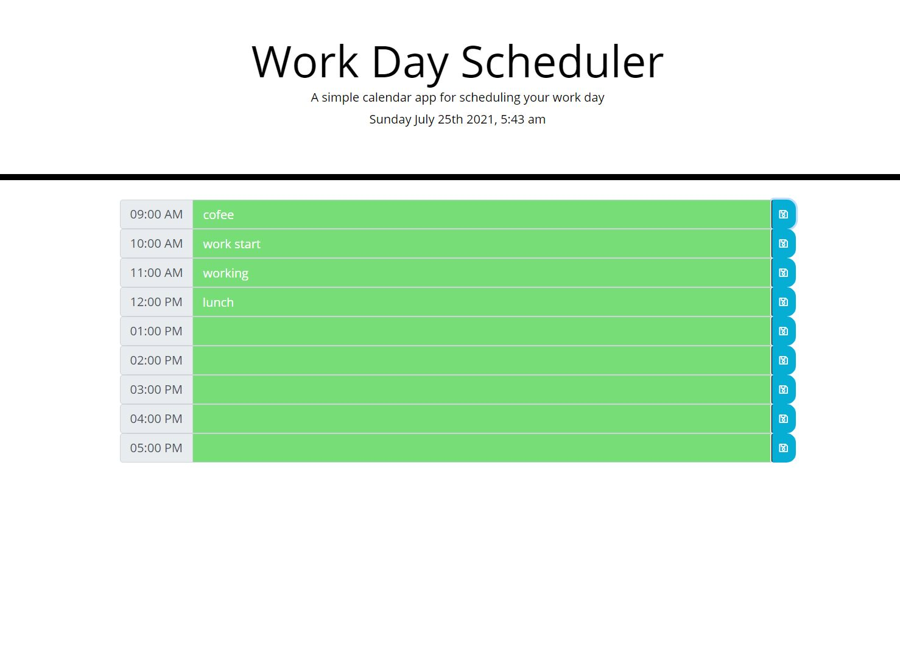

# workday-scheduler-task5'

## WORKING
This application of worday scheduler made with technologies such as HTML, CSS, JAVASCRIPT.
User can schedule 8 hour workday by giving the entrees to the form field.
once form feild filled entries will be stored to local storage.
##home page

## working

## INSTALLATION
User can run this application on the browser (google chrome recommended)

## REFRENCE AND ACKNOWLEDGEMENT
### CODE IDEAS AND FUNCTIONALITY REFERENCE FROM :

https://www.youtube.com/watch?v=n80RRNS1k64
https://stackoverflow.com/
https://github.com/jamierachael/Day-Planner
https://www.youtube.com/watch?v=VtiWrNj94Mk

## GitHub repository link : https://github.com/LohithAmal/workday-scheduler-task5
## live deployed link :  https://lohithamal.github.io/workday-scheduler-task5/
